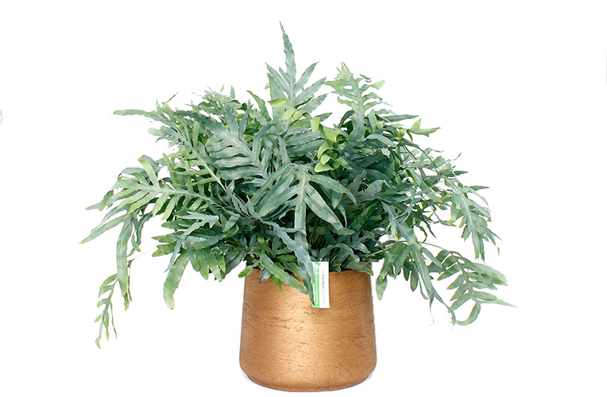

# Phlebodium Aureum \(zinkvaren/blauwvaren\)

## Phlebodium Aureum \(zinkvaren/blauwvaren\)



Deze varen groeit in de natuur in boomtoppen als een epifyt. Dit betekent dat hij op de moederplant groeit zonder hier voedingsstoffen aan te ontrekken.



Weinig eisen zolang er geen direct zonlicht op valt. Dit zorgt voor brandplekken en verkleurde bladeren. Halfschaduw en indirect zonlicht is optimaal. Niet op een plek met veel tocht neerzetten.



Continue een lichtvochtige grond. Zorg dat er geen water in de bodem blijft staan in verband met rotten. 

Geef water aan de zijkant van de plant om een kaal hart te voorkomen.

Sproei de plant af en toe. In de winter wat vaker.



Aangezien het een epifyt is wil de blauwvaren een losse, snel drainende grond. 

Bij het verpotten mogen de rhizomen niet onder de aarde komen. Hier zitten namelijk trichomen op welke water uit de lucht opvangen. Ook komen hier nieuwe wortels en scheuten uit.



Deze plant heeft weinig voeding nodig. Geef enkel voeding in de lente en zomer. In de winter is de plant in rust en kan dit leiden tot schade.

Wanneer er te weinig voedingsstoffen in de grond zitten zullen de bladeren geel kleuren. Vervang dan de aarde, geef extra voeding of verpot de plant. 



Vermeerderen kan door een luchtwortel af te snijden en deze te planten. 

Ook kan de plant tijdens het verpotten opgedeeld worden. Zet de nieuwe planten eventueel een paar dagen in een plastic zak op een warme lichte plek. Dit verminderd het vochtverlies. Er kunnen wat bladeren weggehaald worden om het beschadigde wortelstelsel te compenseren.

Vermeerderen via sporen is ook mogelijk maar een stuk lastiger.



| Probleem | Reden | Oplossing |
| :--- | :--- | :--- |
| Enkel geel blad | Ouder blad, ruimte voor nieuw blad | Eruit knippen |
| Meerdere gele bladeren | Verzorging niet optimaal, te weinig voeding in grond | Geef voeding \(niet in herfst of winter\) of vervang de aarde |
| Bruine bladeren | Te koud water, overbemesting, schimmels in wortels, tocht, lage luchtvochtigheid | Oorzaak achterhalen en gepast oplossen |



